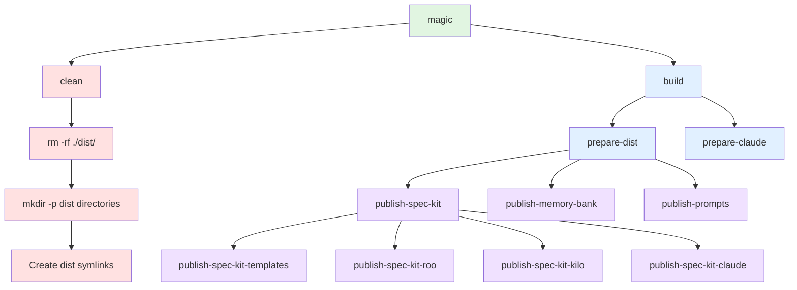
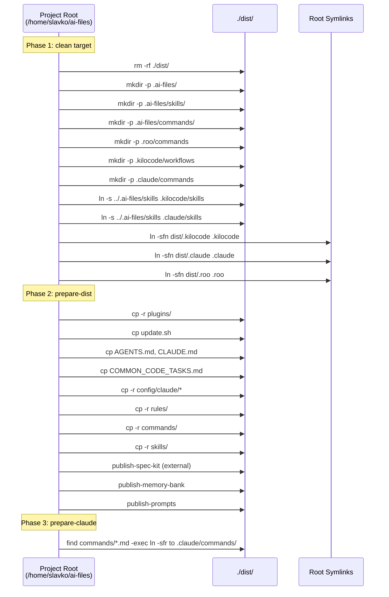
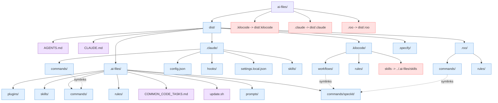

# Makefile Build Process Documentation

This document describes the `make clean build` process for the ai-files project, which creates a distribution directory with symlinks for multiple AI coding assistants (Claude Code, Roo Code, and Kilocode).

## Overview

The build process orchestrates files from the ai-files repository into a `./dist/` directory structure, creating symlinks at the project root for various AI coding tools to access shared resources.

## Build Target Dependency Graph

## Directory Structure Transformation

## Final Directory Structure

## Target Details

### `clean` Target (Lines 7-24)

**Purpose**: Initialize the distribution directory structure and create symlinks.

**Actions**:
1. Removes existing `./dist/` directory
2. Creates directory structure under `./dist/`:
   - `./dist/.ai-files/`
   - `./dist/.ai-files/skills/`
   - `./dist/.ai-files/commands/`
   - `./dist/.roo/commands`
   - `./dist/.kilocode/workflows`
   - `./dist/.claude/commands`

3. Creates shared skills symlinks within dist:
   - `dist/.kilocode/skills` → `../.ai-files/skills`
   - `dist/.claude/skills` → `../.ai-files/skills`

4. Creates root-level symlinks to dist directories:
   - `.kilocode` → `dist/.kilocode`
   - `.claude` → `dist/.claude`
   - `.roo` → `dist/.roo`

### `prepare-dist` Target (Lines 32-51)

**Purpose**: Copy all shared resources to the distribution directory.

**Dependencies**:
- `publish-spec-kit` - Initializes spec-kit templates via specify CLI
- `publish-memory-bank` - Copies memory bank instructions to agents
- `publish-prompts` - Copies prompts directory

**Actions**:
1. Ensures `./dist/.ai-files` exists
2. Copies source files to `./dist/.ai-files/`:
   - `plugins/` → `./dist/.ai-files/plugins/`
   - `update.sh` → `./dist/.ai-files/update.sh`
   - `AGENTS.md` → `./dist/AGENTS.md`
   - `CLAUDE.md` → `./dist/CLAUDE.md`
   - `COMMON_CODE_TASKS.md` → `./dist/.ai-files/COMMON_CODE_TASKS.md`
   - `config/claude/*` → `./dist/.claude/`
   - `rules/` → `./dist/.ai-files/rules/`
   - `commands/` → `./dist/.ai-files/commands/`
   - `skills/` → `./dist/.ai-files/skills/`
3. Makes bash scripts executable: `chmod +x ./dist/.specify/scripts/bash/*.sh`

### `prepare-claude` Target (Lines 53-60)

**Purpose**: Create symlinks for Claude Code commands.

**Actions**:
1. Finds all `*.md` files in `./dist/.ai-files/commands/`
2. Creates relative symlinks in `./dist/.claude/commands/`
3. Each symlink points to the corresponding file in `./dist/.ai-files/commands/`

### `build` Target (Lines 62-63)

**Purpose**: Main build target that orchestrates the entire build process.

**Dependencies**:
- `prepare-dist`
- `prepare-claude`

### `publish-spec-kit` Target (Line 134)

**Purpose**: Initialize spec-kit templates for all supported platforms.

**Dependencies** (executed in order):
1. `publish-spec-kit-templates` - Generic templates using specify CLI
2. `publish-spec-kit-roo` - Roo-specific command symlinks
3. `publish-spec-kit-kilo` - Kilocode-specific workflow symlinks
4. `publish-spec-kit-claude` - Claude-specific skills using specify CLI

### `publish-spec-kit-templates` Target (Lines 148-180)

**Purpose**: Generate spec-kit templates using the specify CLI tool.

**Actions**:
1. Creates a temporary directory
2. Runs `specify init . --ai generic --ai-commands-dir=.ai-files/commands --script sh`
3. Copies `.specify/` to `./dist/.specify/`
4. Copies generated commands to `./dist/.ai-files/commands/speckit/`

### `publish-spec-kit-roo` Target (Lines 92-100)

**Purpose**: Create symlinks for Roo Code commands from speckit.

**Actions**:
1. Creates `./dist/.roo/commands/` directory
2. Finds all `*.md` files in `./dist/.ai-files/commands/speckit/`
3. Creates symlinks in `./dist/.roo/commands/`

### `publish-spec-kit-kilo` Target (Lines 82-90)

**Purpose**: Create symlinks for Kilocode workflows from speckit.

**Actions**:
1. Creates `./dist/.kilocode/workflows/` directory
2. Finds all `*.md` files in `./dist/.ai-files/commands/speckit/`
3. Creates symlinks in `./dist/.kilocode/workflows/`

### `publish-spec-kit-claude` Target (Lines 102-132)

**Purpose**: Initialize Claude Code skills using specify CLI.

**Actions**:
1. Creates a temporary directory
2. Runs `specify init . --ai claude --script sh`
3. Copies `.claude/skills/` to `./dist/.claude/skills/`
4. Note: This replaces the skills symlink created by `clean` with actual copied files

### `publish-memory-bank` Target (Lines 195-209)

**Purpose**: Copy memory bank instructions to agent directories.

**Prerequisites**: `prompts/memory-bank-instructions.md` must exist (use `update-memory-bank` first)

**Actions**:
1. Creates `./dist/.roo/rules/memory-bank/` and `./dist/.kilocode/rules/memory-bank/`
2. Copies `prompts/memory-bank-instructions.md` to both directories

### `publish-prompts` Target (Lines 65-67)

**Purpose**: Copy prompts directory to distribution.

**Actions**:
1. Creates `./dist/.ai-files/prompts/`
2. Copies `./prompts/` to `./dist/.ai-files/prompts/`

## Source and Destination Directories

| Source Directory | Destination Directory | Copy Method |
|-----------------|----------------------|-------------|
| `plugins/` | `./dist/.ai-files/plugins/` | cp -r |
| `commands/` | `./dist/.ai-files/commands/` | cp -r |
| `skills/` | `./dist/.ai-files/skills/` | cp -r |
| `rules/` | `./dist/.ai-files/rules/` | cp -r |
| `prompts/` | `./dist/.ai-files/prompts/` | cp -r |
| `config/claude/*` | `./dist/.claude/` | cp -r |
| `update.sh` | `./dist/.ai-files/update.sh` | cp |
| `AGENTS.md` | `./dist/AGENTS.md` | cp |
| `CLAUDE.md` | `./dist/CLAUDE.md` | cp |
| `COMMON_CODE_TASKS.md` | `./dist/.ai-files/COMMON_CODE_TASKS.md` | cp |
| (spec-kit temp) | `./dist/.ai-files/commands/speckit/` | cp -r |
| (spec-kit temp) | `./dist/.specify/` | cp -r |
| (spec-kit temp) | `./dist/.claude/skills/` | cp -r |

## Symlink Summary

### Created by `clean` target (within dist):
- `dist/.kilocode/skills` → `../.ai-files/skills`
- `dist/.claude/skills` → `../.ai-files/skills`

### Created by `clean` target (at project root):
- `.kilocode` → `dist/.kilocode`
- `.claude` → `dist/.claude`
- `.roo` → `dist/.roo`

### Created by `prepare-claude`:
- `./dist/.claude/commands/*.md` → `./dist/.ai-files/commands/*.md` (relative symlinks)

### Created by `publish-spec-kit-roo`:
- `./dist/.roo/commands/*.md` → `./dist/.ai-files/commands/speckit/*.md` (relative symlinks)

### Created by `publish-spec-kit-kilo`:
- `./dist/.kilocode/workflows/*.md` → `./dist/.ai-files/commands/speckit/*.md` (relative symlinks)

## Important Notes

1. **Shared Skills Directory**: The `skills/` directory is shared between Claude Code and Kilocode via symlinks pointing to `./dist/.ai-files/skills/`.

2. **Spec-kit Override**: The `publish-spec-kit-claude` target replaces the Claude skills symlink with actual files copied from the specify CLI output, while Kilocode continues to use the symlink.

3. **Symlink Semantics**: The `ln -sfn` command forces the creation of symlinks, removing existing ones if they exist.

4. **External Dependencies**: The `publish-spec-kit-*` targets depend on the `specify` CLI tool being installed (`pipx install specify-cli`).

---

## Available Installation Tools

### Specification/Documentation Tools

| Target | Tool | Installation Method | Notes |
|--------|------|---------------------|-------|
| `install-spec-bmad` | bmad-method | npm (global) | Business Model Analysis & Design methodology tool |
| `install-spec-bmad-local` | bmad-method | npx (local) | Local installation variant of bmad-method |
| `install-spec-kit` | specify-cli | pipx (from GitHub) | Spec-kit CLI tool installed from GitHub repo, uses pyenv python |
| `install-spec-openspec` | @fission-ai/openspec | npm (global) | Open specification tool by Fission AI |
| `install-spec-openspec-local` | @fission-ai/openspec | npx (local) | Local installation variant of openspec |
| `install-mermaid-cli` | @mermaid-js/mermaid-cli | npm (global) | Mermaid diagram CLI tool for generating diagrams from text |

### AI Coding CLIs

| Target | Tool | Installation Method | Notes |
|--------|------|---------------------|-------|
| `install-cli-claude-code` | claude-code | curl (from Google Cloud Storage) | Anthropic's Claude Code CLI - auto-detects platform (Linux/Darwin, x64/arm64), downloads from official releases, verifies checksums |
| `install-cli-anthropic-claude-code` | @anthropic-ai/claude-code | npm (global) | Alternative Claude Code installation via npm - refer to Obsidian KB for usage |
| `install-cli-aider` | aider-chat | pipx | Aider AI coding assistant - includes google-generativeai integration, refer to Obsidian KB for usage |
| `install-cli-taskmaster` | task-master-ai | npm (global) | Task management AI tool - use `task-master init` on new projects |
| `install-gemini-cli` | @google/gemini-cli | npm (global) | Google Gemini CLI tool |
| `install-opencode-cli` | opencode | curl/tar | OpenCode CLI installed to $HOME/dotfiles/bin (or $INSTALL_DIR) |

### Desktop Applications

| Target | Tool | Installation Method | Notes |
|--------|------|---------------------|-------|
| `install-aider-desk` | aider-desk | AppImage (from GitHub releases) | Aider desktop application - downloads x86_64 AppImage to ~/Applications |
| `install-desktop-ai-goose` | goose | .deb (from GitHub releases) | Goose desktop application - installs via dpkg, requires sudo |
| `install-opencode-desktop` | opencode | AppImage (direct download) | OpenCode desktop AppImage - downloads to ~/Applications |

### Other Utilities

| Target | Tool | Installation Method | Notes |
|--------|------|---------------------|-------|
| `install-antigravity-apt` | antigravity | apt (from custom repo) | Adds Antigravity apt repository, installs via apt - requires sudo for repository setup |
| `install-ai-goose` | goose | bash installer (from GitHub releases) | Goose CLI - downloads latest release, installs to ~/ai-files/bin |
| `install-mcp-memory-service` | mcp-memory-service | pipx | MCP Memory Service with onnxruntime injection |
| `install-cli-to-local-bin` | ai-files-cli | symlink | Creates symlink from project bin/ai-files-cli to ~/.local/bin/ai-files-cli |

### Installation Categories Summary

**Spec/Specification Tools (6):**
- bmad-method (global/local)
- specify-cli
- openspec (global/local)
- mermaid-cli

**AI Coding CLIs (6):**
- claude-code (official)
- @anthropic-ai/claude-code (npm)
- aider-chat
- task-master-ai
- gemini-cli
- opencode-cli

**Desktop Applications (3):**
- aider-desk (AppImage)
- goose desktop (.deb)
- opencode desktop (AppImage)

**Other Utilities (4):**
- antigravity (apt)
- goose CLI
- mcp-memory-service
- ai-files-cli (symlink)
