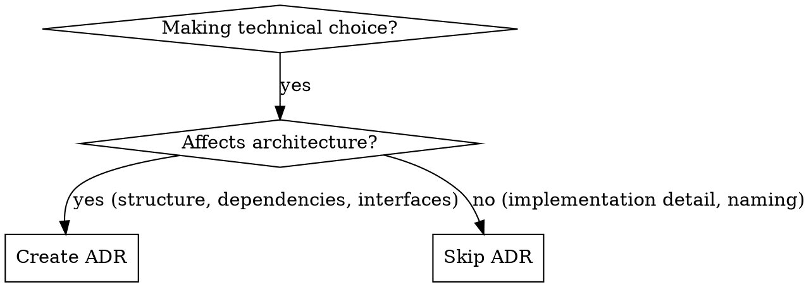

# ADR Tools

## Overview

Architecture Decision Records (ADRs) document significant architectural choices: what you decided, why, and the consequences. The adr-tools CLI manages these records.

**Core principle:** Write ADRs for decisions that affect structure, dependencies, interfaces, or construction techniques. Not every technical choice needs an ADR.

## When to Use



**Use ADRs for:**
- Technology choices (frameworks, databases, libraries)
- Architectural patterns (microservices, event-driven, etc.)
- Significant refactors or migrations
- Integration approaches between systems

**Don't use ADRs for:**
- Implementation details
- Naming conventions
- Trivial optimizations
- Temporary workarounds

## Quick Reference

| Operation | Command | Description |
|-----------|---------|-------------|
| Initialize | `/adr init [dir]` | Create ADR repository |
| Create | `/adr new <title>` | New decision record |
| Supersede | `/adr new <title> --supersede <n>` | Replace decision n |
| Link | `/adr new <title> --link <n>:rel:rev` | Link to another ADR |
| List | `/adr list` | Show all ADRs |
| View | `/adr view <n|title>` | Display specific ADR |

**Detailed command reference:** See [commands.md](commands.md)

## ADR Structure

Each ADR follows this format:

```markdown
# NUMBER. TITLE

Date: YYYY-MM-DD

## Status
Accepted | Proposed | Superseded by N

## Context
The issue motivating this decision.

## Decision
What we're implementing.

## Consequences
What becomes easier/harder, risks introduced.
```

## Status Values

- **Accepted**: Current active decision
- **Proposed**: Not yet agreed upon
- **Superseded**: Replaced by newer decision (with link)

## Linking ADRs

ADRs can show relationships:
- **Supersedes/Superseded by**: Decision replacement
- **Amends/Amended by**: Modification to existing decision
- **Depends on/Required by**: Dependency between decisions
- **Relates to/Related to**: General reference

## Best Practices

1. **One decision per ADR** - Keep focused
2. **Include the "why"** - Document context and alternatives
3. **Don't delete old ADRs** - Mark as superseded with link
4. **Review periodically** - Update as project evolves

## Common Mistakes

| Mistake | Fix |
|---------|-----|
| Documenting trivial choices | Only architectural decisions |
| Deleting old decisions | Mark as superseded |
| Missing context/consequences | Complete all sections |
| Multiple decisions in one ADR | Split into separate records |

## Directory Discovery

The skill searches for ADR directories in order:
1. `.adr-dir` file (created by `adr init`)
2. `doc/adr` directory
3. Searches up directory tree from current location
