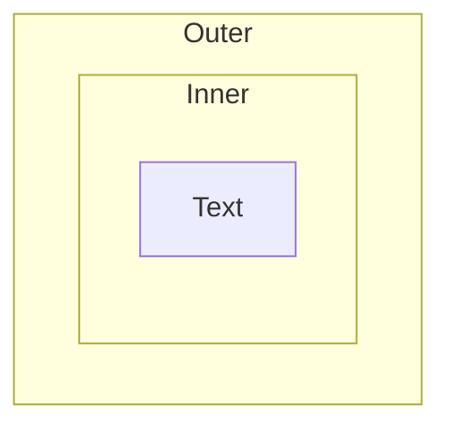
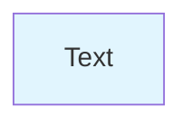
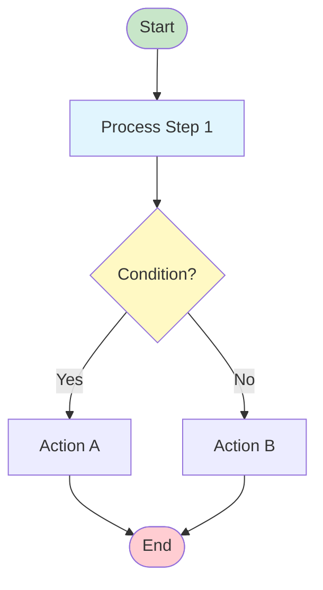

# Mermaid Diagram Rules

When creating Mermaid diagrams, follow these rules to avoid parsing errors:

## Critical Syntax Rules

### 1. Square Brackets in Edge Labels (PRIMARY CAUSE OF PARSE ERRORS)

**ROOT CAUSE:** Square brackets `[]` in edge labels (text between `|...|`) are interpreted as node syntax, NOT literal text.

**WRONG:**
```mermaid
A -->|Returns from_assets[]| B
```
Error: `Expecting ... got 'SQS'` (Square bracket start)

**RIGHT:**
```mermaid
A -->|Returns from_assets list| B
A -->|Returns from_assets array| B
A -->|Returns assets with cg_id| B
```

**RULE:** In edge labels, replace `[]` with words like "list", "array", "collection", or omit entirely.

### 2. Parentheses in Rectangle Nodes (SECONDARY CAUSE OF PARSE ERRORS)

**ROOT CAUSE:** Parentheses `()` inside rectangle node text `[...]` conflict with rounded node syntax `Node(Text)`.

In Mermaid:
- `Node[Text]` = rectangle node
- `Node(Text)` = rounded rectangle node
- Having `()` inside `[]` creates syntax ambiguity

**WRONG:**
```mermaid
CryptoToCrypto[to_amount =<br/>(from_amount times price)<br/>divided by rate]
```
Error: `Expecting ... got 'PS'` (Parenthesis start)

**RIGHT:**
```mermaid
CryptoToCrypto[Convert via CHF:<br/>from_amount times from_asset CHF<br/>divided by to_asset CHF]
CryptoToCrypto[Calculate to_amount using CHF prices]
```

**RULE:** In rectangle nodes `[...]`, replace `()` with descriptive text or omit entirely. Use mathematical formulas in tables below the diagram.

### 3. Square Bracket + Parenthesis Combination (TERTIARY CAUSE OF PARSE ERRORS)

**ROOT CAUSE:** The pattern `[(text)]` - square bracket `[` immediately followed by parenthesis `(` - is interpreted as a cylinder node syntax, causing ambiguity.

In Mermaid:
- `Node[Text]` = rectangle node
- `Node[(Text)]` = cylinder node (database)
- When you write `Node[(text)...]` inside a rectangle, Mermaid sees the `[(` pattern and expects a cylinder

**WRONG:**
```mermaid
Calc[(from * CHF_from) / CHF_to]
```
Error: `Expecting 'CYLINDEREND', 'TAGEND', ... got 'PE'` (Parenthesis End expected in wrong context)

**RIGHT:**
```mermaid
Calc[from_amount * CHF_from / CHF_to]
Calc[Convert via CHF intermediate]
```

**RULE:** Never use the `[(text)]` pattern in rectangle nodes. Remove parentheses or use descriptive text.

### 4. Parameter Placeholders - Avoid Curly Braces (PANDOC COMPATIBILITY)

**CRITICAL:** Curly braces `{}` cause issues in BOTH Mermaid syntax AND pandoc markdown-to-PDF rendering.

**ROOT CAUSE:**
- In Mermaid: `{}` have special meaning
- In pandoc: `{}` can interfere with LaTeX/templating
- Result: Broken diagrams in PDF exports

**WRONG:**
```mermaid
NodeA[GET /v1/order/info/{orderId}/]
NodeB[Query with ids={from,to}]
```

**RIGHT - Use Angle Brackets or Descriptive Words:**
```mermaid
NodeA[GET /v1/order/info/<orderId>/]
NodeB[Query with ids: from_cg_id, to_cg_id]
NodeC[Endpoint with parameter orderId]
```

**ALTERNATIVES for parameter placeholders:**
| Symbol | Use Case | Example |
|--------|----------|---------|
| `< >` | Parameter placeholders | `<orderId>`, `<cg_id>` |
| Descriptive words | API docs, tables | "orderId parameter", "asset IDs" |
| `: ` (colon) | Label-like | "ids: from, to" |
| Words only | Cleanest for PDF | "order identifier" |

**RULE:** Never use `{}` for parameter placeholders. Use `<>` or descriptive text instead.

### 5. Avoid Nested Subgraphs with Same Node IDs
Nested subgraphs can cause conflicts. Prefer flat diagrams with styles for grouping:

**WRONG:**


**RIGHT:**


### 6. Node Syntax Reference

| Shape | Syntax | Example |
|-------|--------|---------|
| Rectangle | `ID[Text]` | `Step1[Process data]` |
| Rounded | `ID(Text)` | `Step2(Process data)` |
| Stadium | `ID([Text])` | `Start([Begin])` |
| Diamond | `ID{Text}` | `Decision{Is valid?}` |
| Cylinder | `ID[(Text)]` | `Database[(Data)]` |

### 7. Edge Labels with Special Characters
Edge labels should avoid complex operators and special characters:

**WRONG:**
```mermaid
A -->|ids={from,to}| B
```

**RIGHT:**
```mermaid
A -->|ids: from_cg_id, to_cg_id| B
A -->|Builds query with ids| B
```

### 8. Use Simple Text
Avoid mathematical notation, code snippets, or complex formulas in node text. Put those in tables below the diagram.

**WRONG:**
```mermaid
Calc[to_amount = (from * price[from].chf) / price[to].chf]
```

**RIGHT:**
```mermaid
Calc[Calculate to_amount using CHF prices]
```
(Then document the formula in a table below)

### 9. Always Test
After creating a diagram, test it in:
- VS Code with Mermaid preview extension
- Online: mermaid.live
- Your documentation renderer
- **CLI validation using mmdc** (if available)

### 10. CLI Validation with mmdc

If the `mmdc` (Mermaid CLI) tool is available, validate diagram syntax before committing:

```bash
# Create temporary file with diagram content
cat > /tmp/diagram.mmd << 'EOF'
flowchart TD
    Start([Start]) --> End([End])
EOF

# Validate syntax (outputs nothing if valid, error if invalid)
mmdc -i /tmp/diagram.mmd -o /dev/null
```

**Example wrapper function:**
```bash
validate_mermaid() {
    local diagram="$1"
    echo "$diagram" > /tmp/diagram.mmd
    if mmdc -i /tmp/diagram.mmd -o /dev/null 2>&1; then
        echo "✓ Mermaid syntax valid"
        return 0
    else
        echo "✗ Mermaid syntax error"
        return 1
    fi
}
```

**Install mmdc if needed:**
```bash
npm install -g @mermaid-js/mermaid-cli
```

## Common Error Patterns

| Error | Cause | Fix |
|-------|-------|-----|
| `Expecting ... got 'SQS'` | Square brackets `[]` in edge label like `\|text[]\|` | Replace `[]` with "list", "array", or remove |
| `Expecting ... got 'PS'` | Parentheses `()` inside rectangle node `[text(...)]` | Remove `()`, use descriptive text |
| `Expecting ... got 'PE'` | Square bracket + parenthesis pattern `[(` interpreted as cylinder | Remove `()`, avoid `[(` pattern |
| `Expecting 'SQE'... got 'DIAMOND_START'` | Unescaped `{}` in node text | Replace `{}` with `<>` or descriptive words |
| Pandoc PDF render fails | `{}` used as parameter placeholders | Use `<param>` or descriptive text instead |
| `Parse error` in subgraph | Nested subgraphs with node conflicts | Flatten structure, use styles |
| Edge label breaks | Special chars in `-->|label|` | Simplify label text, avoid `[]`, `{}`, `()` |
| `Unexpected character` | Reserved chars in node ID | Use alphanumeric IDs only |

## Recommended Template



